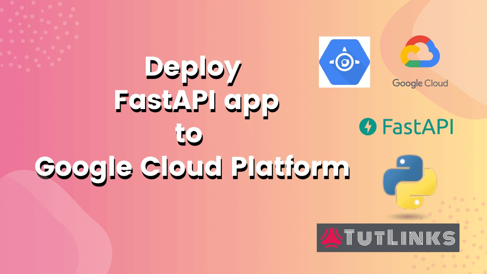

# Web Application with Google Cloud Platform (GCP) Integration



## Introduction

This project is a FastAPI-based web application that integrates with various Google Cloud Platform (GCP) services such as Google Cloud Storage (GCS), Vertex AI, and also includes functionality to list Docker images and trigger builds using CircleCI.

## Prerequisites

- Python 3.9+
- Docker
- GCP Account with appropriate permissions
- CircleCI Account and Token

## Setup

1. Clone the repository

```sh
$ git clone <repository-url>
$ cd <repository-folder>
```

2. Set up a virtual environment and install the required packages

```sh
$ python3 -m venv venv
$ source venv/bin/activate
$ pip install -r requirements.txt
```

3. Set up your GCP credentials. Follow the guide [here](https://cloud.google.com/docs/authentication/getting-started) to get your credentials JSON file and set the `GOOGLE_APPLICATION_CREDENTIALS` environment variable.

```sh
$ export GOOGLE_APPLICATION_CREDENTIALS="/path/to/your/credentials.json"
```

4. Build and run the Docker container

```sh
$ docker build -t gcp-web-app .
$ docker run -d -p 8000:8000 gcp-web-app
```

5. Open your browser and go to `http://localhost:8000/docs` to view the Swagger UI for the API documentation.

## Endpoints

### Root Endpoint

- **GET /**
  - Description: Returns a welcome message
  - Example Response:
```json
{
  "Hello": "World"
}
```

### List GCS Buckets

- **GET /gcs-buckets**
  - Description: Lists all Google Cloud Storage buckets in the project
  - Example Response:
```json
{
  "buckets": ["bucket1", "bucket2"]
}
```

### List Vertex AI Models

- **GET /vertex-ai-models**
  - Description: Lists all Vertex AI models
  - Example Response:
```json
{
  "models": ["model1", "model2"]
}
```

### List Docker Images

- **GET /docker-images**
  - Description: Lists all Docker images on the host
  - Example Response:
```json
{
  "docker_images": ["image1:tag", "image2:tag"]
}
```

### Trigger CircleCI Build

- **POST /trigger-circleci-build**
  - Description: Triggers a CircleCI build for a specified project
  - Request Body:
```json
{
  "project_slug": "github/org_name/repo_name"
}
```
  - Example Response:
```json
{
  "response": {...}
}
```

## Finishing Up

The application should now be running and ready to use. You can see the Swagger UI for easy testing and API documentation at `http://localhost:8000/docs`.

## Future Improvements

- Add authentication to the endpoints.
- Extend API functionalities.
- Add unit and integration tests.

## License

This project is licensed under the MIT License.